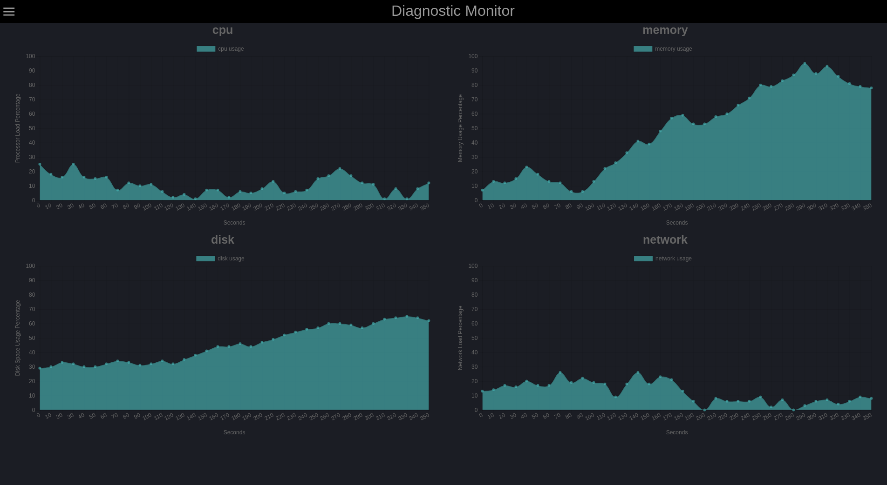
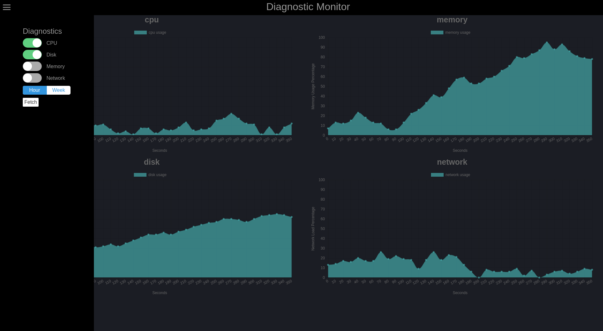
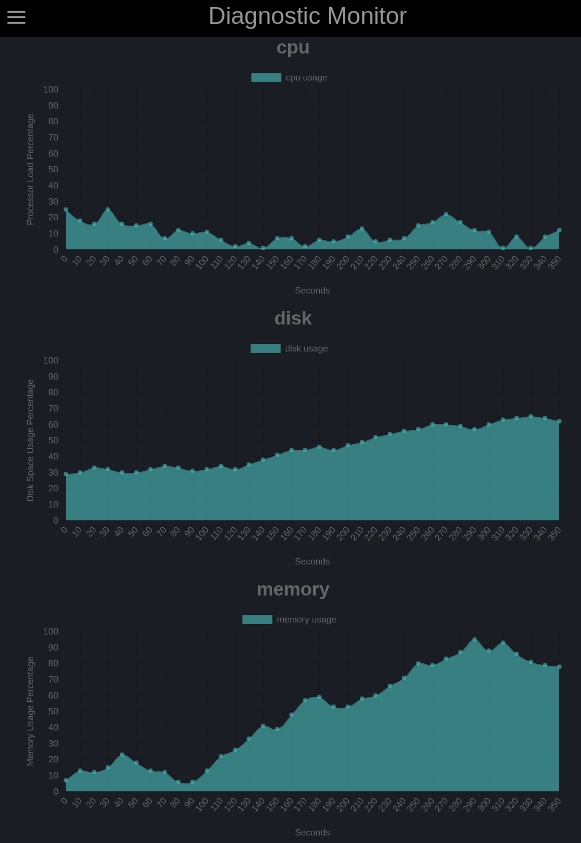
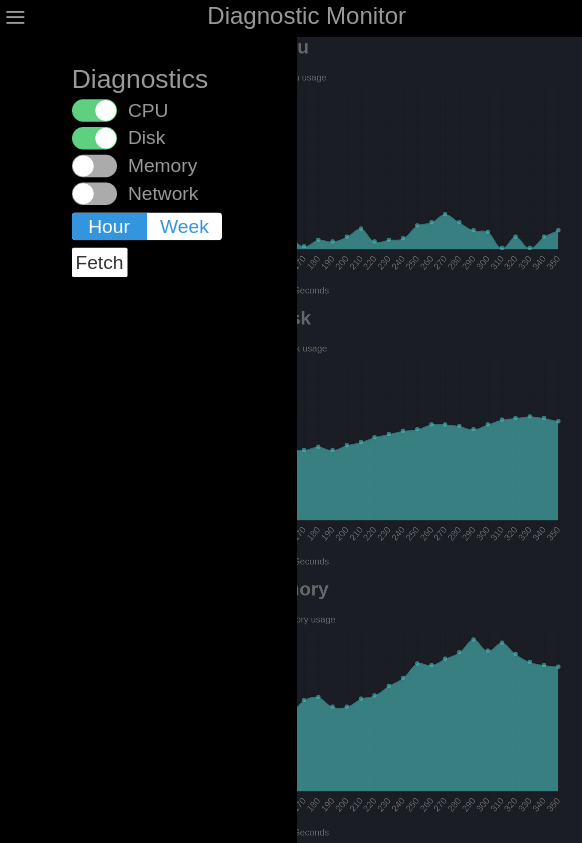

# Diagnostic Monitoring Frontend

- **Author**: Steve Carpenter
- **Version**: 1.0.0

## Overview
This is a simple React based front end that displays device diagnostic information
in line charts using ChartJS. It will interface with a server that serves up usage
data about the supported devices.






## Getting Started
- Clone the repository to your local directory from [here](https://github.com/TimeSeriesDataApp/frontend)
- Install all the necessary modules using the `npm install` command in the cloned directory
- Create a `.dev.env` file at the root of the cloned directory that has the same contents as below
- Run `npm run watch` to trigger webpack to create a build and start a server
- Visit `http://localhost:8080` in your browser to start using the page
- Note that the server must also be running for the front end to successfully fetch data

`.dev.env`
```
CDN_URL=/
NODE_ENV=dev
API_URL=http://localhost:3000
```

## Testing
The current test suite only has shallow mounted tests, but a set of full DOM mounted tests
will be added at a later date. It is not necessary to have the backend active to run the
test suite for this reason. The test suite can be run using the terminal command `npm run test`.

`Current Testing State`
```
 PASS  src/__test__/component/sidebar.test.js
  <Sidebar />
    Shallow Mounting
      ✓ should render a Sidebar component (8ms)
      ✓ should set the Sidebar container as a <div> (4ms)
      ✓ should have a state reflecting devices passed in (3ms)
      ✓ should have set the correct selected segment control from provided data (2ms)
      ✓ should initialize all values for state from localStorage when available (2ms)
      ✓ should not modify values in state not found in localStorage (5ms)
      ✓ should render selection sliders for all 6 devices provided in props (3ms)
      ✓ should render two segment controls that were provided in props (2ms)

 PASS  src/__test__/component/dashboard.test.js
  <Dashboard />
    Shallow Mounting
      ✓ should render a Dashboard component (2ms)
      ✓ should set the Dashboard container as a <div> (1ms)
      ✓ should have a default state containing a rawData property as an empty array (1ms)
      ✓ should render a <Sidebar /> component
      ✓ should not have rendered any Line charts yet (1ms)
      ✓ should have a <div> asking user to choose devices when no charts are present (1ms)

 PASS  src/__test__/component/chart.test.js
  <Chart />
    Shallow Mounting
      ✓ should render a Chart component inside a <div> (2ms)
      ✓ should set the Chart container as a <div>
      ✓ should not have any state object (1ms)
      ✓ should contain a Line chart from the react-chartjs-2 library

 PASS  src/__test__/component/navbar.test.js
  <Navbar />
    Shallow Mounting
      ✓ should render a Navbar component (2ms)
      ✓ should create an input checkbox for the hamburger toggle (3ms)
      ✓ should create a simple Navbar <div> container (2ms)
      ✓ should not contain any state (1ms)

---------------------|----------|----------|----------|----------|-------------------|
File                 |  % Stmts | % Branch |  % Funcs |  % Lines | Uncovered Line #s |
---------------------|----------|----------|----------|----------|-------------------|
All files            |    52.17 |    38.71 |       52 |    49.23 |                   |
 component/chart     |      100 |      100 |      100 |      100 |                   |
  index.js           |      100 |      100 |      100 |      100 |                   |
 component/dashboard |       25 |     5.88 |    18.18 |       25 |                   |
  index.js           |       25 |     5.88 |    18.18 |       25 |... ,74,80,114,122 |
 component/navbar    |      100 |      100 |      100 |      100 |                   |
  index.js           |      100 |      100 |      100 |      100 |                   |
 component/sidebar   |    76.92 |       80 |       70 |       75 |                   |
  index.js           |    76.92 |       80 |       70 |       75 | 40,41,45,47,51,52 |
 lib                 |      100 |       75 |      100 |      100 |                   |
  utils.js           |      100 |       75 |      100 |      100 |                 3 |
---------------------|----------|----------|----------|----------|-------------------|
Test Suites: 4 passed, 4 total
Tests:       22 passed, 22 total
Snapshots:   0 total
Time:        1.456s
Ran all test suites.
```

## Architecture
- [JavaScript](https://www.javascript.com/)
- [ReactJS](https://reactjs.org/)
- [React ChartJS 2](https://github.com/jerairrest/react-chartjs-2)
- [Webpack](https://webpack.js.org/)
- [npm](https://npmjs.org/)
